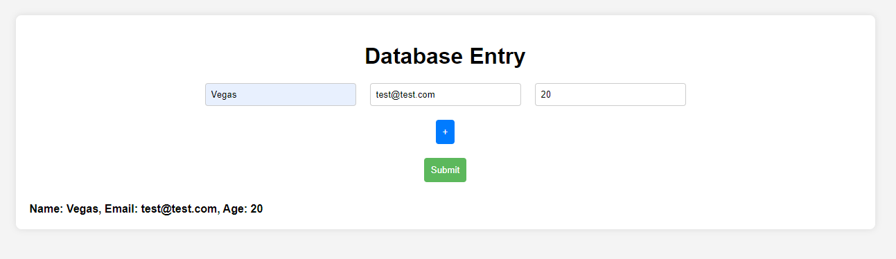

# Basic Database Entry FOrm

A simple web application for entering data into a database, built using HTML, CSS, and JavaScript.

## Features

- Dynamically add rows for data entry
- Submit the form to store data in a database
- Dark mode toggle for better user experience
- Responsive design for compatibility with various devices

## Demo

[Live Demo](https://ignvegas.github.io/DatabaseEntry/)

## Installation
   git clone https://github.com/ignvegas/databaseentry.git
   

